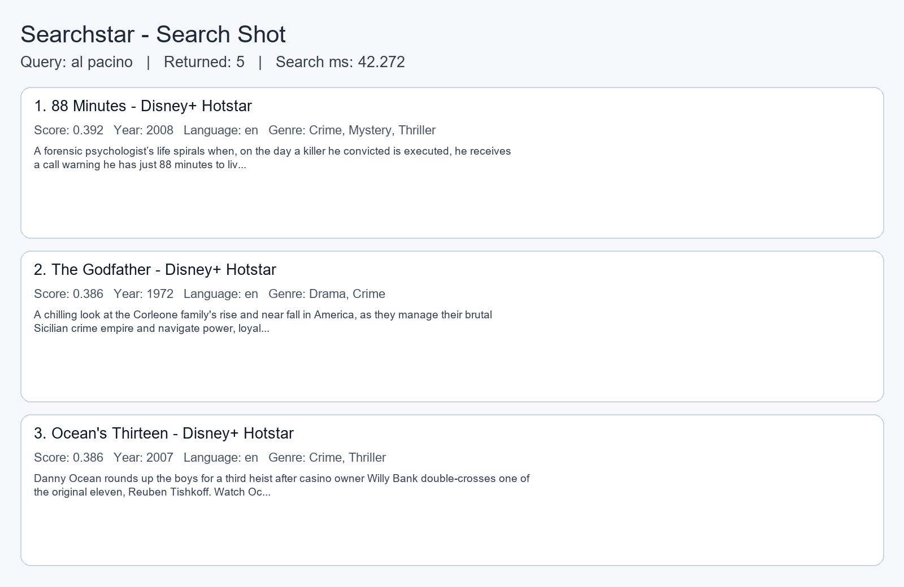
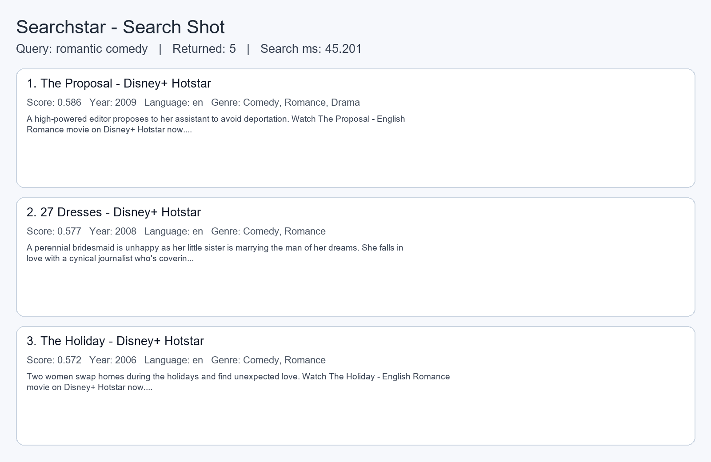
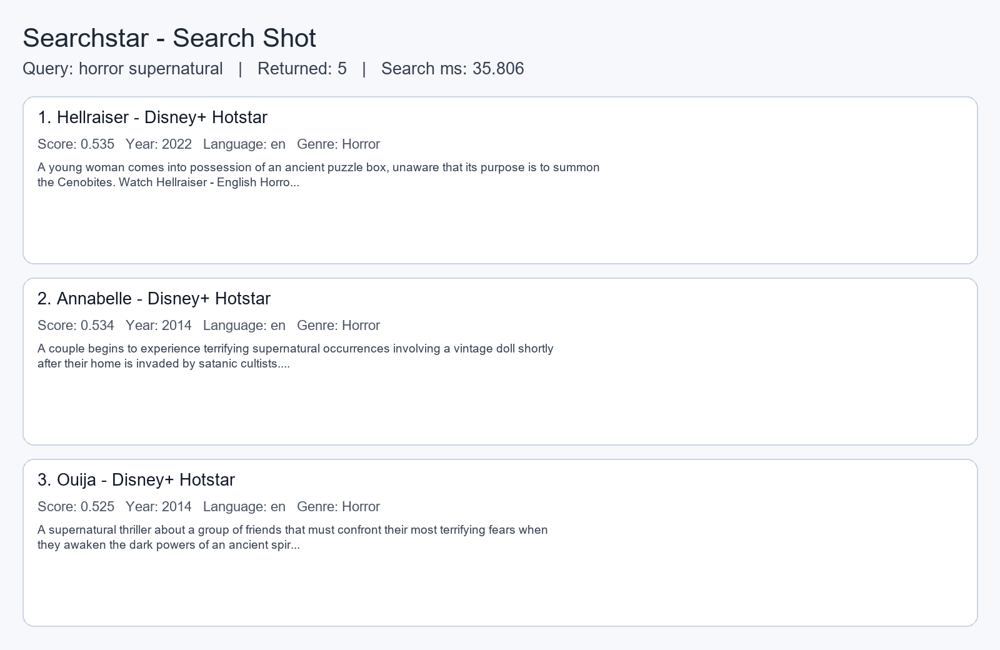

# Searchstar

Semantic movie search over a Hotstar-style catalog using FastAPI + Qdrant + text embeddings.

## What this project does

- Scrapes movie/show pages (from sitemap discovery) into structured JSON.
- Enriches records with metadata (genre/cast/keywords/language/runtime/rating).
- Embeds records into vectors.
- Stores vectors in Qdrant.
- Serves a search API with lexical boosting on top of vector similarity.
- Provides a lightweight frontend to query results.

---

## Project structure

- `backend/main.py` — FastAPI app (`/search`, `/health`, `/docs`)
- `backend/scraper.py` — async sitemap/content scraper (+ optional TMDB enrichment)
- `backend/enrich_dataset.py` — enrich/clean pipeline from CSV resources
- `backend/embedder.py` — embedding generation (`hf-inference` or local sentence-transformers)
- `backend/qdrant_db.py` — ingest embedded JSON into Qdrant
- `backend/check_search_quality.py` — smoke test for search relevance
- `frontend/` — static HTML/CSS/JS search UI
- `data/` — source and generated datasets
- `qdrant_storage/` — local Qdrant persistence

---

## Requirements

- Python 3.10+
- A running Qdrant instance on `http://localhost:6333`
- Hugging Face token (`HF_TOKEN`) for `BAAI/bge-m3` inference

Install dependencies:

```bash
pip install -r requirements.txt
```

Create `.env` in the project root:

```env
HF_TOKEN=your_huggingface_token
HF_MODEL=BAAI/bge-m3
QDRANT_URL=http://localhost:6333
QDRANT_COLLECTION=hotstar_catalog
LOG_LEVEL=INFO
# Optional
TMDB_API_KEY=your_tmdb_key
```

---

## Quick start (serve search API + frontend)

### 1) Start backend

From project root:

```bash
uvicorn backend.main:app --host 127.0.0.1 --port 8010 --reload
```

Check health:

```bash
curl http://127.0.0.1:8010/health
```

### 2) Start frontend

Serve `frontend/` with any static server (for example VS Code Live Server):

- Open `frontend/index.html` at `http://127.0.0.1:5500/index.html`
- Set **Backend URL** to `http://127.0.0.1:8010`

### 3) Try search

```bash
curl "http://127.0.0.1:8010/search?q=al%20pacino&k=5"
```

---

## Data pipeline

Run from project root.

### A) Scrape Hotstar catalog

```bash
python backend/scraper.py --output data/hotstar_scraped.json --verbose
```

Useful options:

- `--discover-latest / --no-discover-latest`
- `--region in --region us` (repeatable)
- `--sitemap-hint MOVIE --sitemap-hint SHOWS` (repeatable)
- `--tmdb-api-key <key>`
- `--max-urls 500`

### B) Enrich records with local metadata CSVs

```bash
python backend/enrich_dataset.py \
  --input data/hotstar_scraped.json \
  --output data/hotstar_quality_5000_final.json \
  --movies-metadata data/movies_metadata.csv \
  --keywords data/keywords.csv \
  --credits data/credits.csv \
  --target-count 5000 \
  --verbose
```

### C) Generate embeddings

```bash
python backend/embedder.py \
  --input data/hotstar_quality_5000_final.json \
  --output data/hotstar_embedded.json \
  --backend hf-inference \
  --hf-model BAAI/bge-m3 \
  --batch-size 32 \
  --verbose
```

### D) Ingest into Qdrant

```bash
python backend/qdrant_db.py \
  --input data/hotstar_embedded.json \
  --qdrant-url http://localhost:6333 \
  --collection hotstar_catalog \
  --batch-size 256 \
  --verbose
```

---

## API

### `GET /health`

Returns service status.

### `GET /search`

Query params:

- `q` (required): search text
- `k` (optional, default `5`): number of results
- `top_k` (deprecated alias of `k`)
- `year` (optional): filter by release year
- `language` (optional): filter by language code (`en`, `hi`, `ta`, ...)

Example:

```bash
curl "http://127.0.0.1:8010/search?q=crime%20thriller&k=5&language=en"
```

Interactive docs: `http://127.0.0.1:8010/docs`

---

## Search quality smoke test

```bash
python backend/check_search_quality.py --base-url http://127.0.0.1:8010 --top-k 5 --timeout 20
```

---

## Search shots

Generated examples from live API responses:







To regenerate:

```bash
python backend/capture_search_shots.py
```

---

## Notes

- Ensure Qdrant collection vector size matches embedding model output (for `BAAI/bge-m3`, expected size is 1024 in this project).
- The backend requires `HF_TOKEN` at startup; missing token will fail app initialization.
- CORS origins are controlled by `FRONTEND_ORIGINS` in `backend/main.py`.
